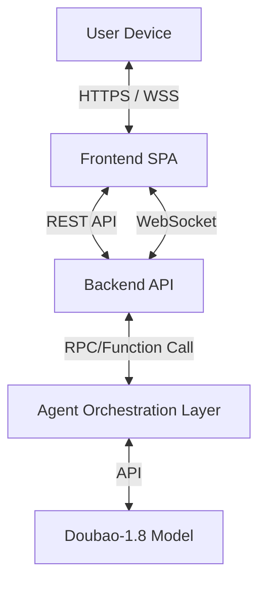

# 🛠️ Maia Tech Stack & Architecture

## 1. High-Level Architecture
Maia 采用 **前后端分离 (Client-Server Separation)** 架构，确保视觉表现层的极致灵活性与后端逻辑层的严密性。

## 2. Frontend (The "Cinematic" Interface)
基于现有原型 (`ux:ui-Agents头像漂浮在光点空间`) 演进，打造沉浸式“思维空间”。

*   **Framework**: **React 18 + Vite**
    *   *理由*: 工业级标准，组件化管理 UI 状态（如聊天气泡、按钮状态），方便集成第三方库。
*   **Visual Engine**: **p5.js** (via `react-p5` or native integration)
    *   *理由*: 复用现有的光斑/粒子/漂浮动画逻辑，实现“会呼吸”的动态背景。
*   **State Management**: **Zustand**
    *   *理由*: 轻量级状态管理，用于同步 5 个 Agent 的实时状态（如：`Analyst: Thinking`, `Judge: Rejecting`）。
*   **Audio**: Native Web Audio API
    *   *理由*: 处理流式音频播放与录音。

### 交互模式 (Interaction Mode)
*   **Walkie-Talkie (对讲机模式)**: 
    *   按键录音 -> 停止 -> STT 转写 -> 用户编辑确认 -> 发送文本。
    *   **关键约束**: 输入给 Backend 的永远是**文本 (Text)**。

## 3. Backend (The "Orchestrator")
处理复杂的 Agent 编排与状态流转。

*   **Runtime**: **Python 3.10+**
*   **Web Framework**: **FastAPI**
    *   *理由*: 
        1.  原生支持 **Async/Await**，完美适配 LLM 的流式输出。
        2.  原生支持 **WebSocket**，实现“主动响应”的主推机制（服务端主动推 Agent 状态给前端）。
*   **Orchestration Engine**: **Custom (Native Python)**
    *   *理由*: 不依赖 LangChain 等重型框架，直接编写清晰的 `Analyst -> Judge -> Interviewer` 状态机代码，易于调试。
*   **Data Validation**: **Pydantic**
    *   *理由*: 严格校验 JSON Schema (特别是 Analyst 的输出)。

## 4. AI & Voice Services (Doubao Cloud)

### 4.1 LLM Service
*   **Model**: `doubao-seed-1-8-251228` (Doubao-1.8-pro)
*   **Access**: Volcengine Python SDK (`volcenginesdkarkruntime`)
*   **Mode**: Streaming Response (Server-Sent Events)

### 4.2 ASR (Streaming Speech Recognition)
*   **Protocol**: WebSocket (WSS)
*   **Service URL**: `wss://openspeech.bytedance.com/api/v3/asr/stream` (Confirm specific endpoint in docs)
*   **Authentication**: Custom Headers in Handshake (`X-Api-App-Key`, `X-Api-Access-Key`, `X-Api-Resource-Id`)
*   **Implementation Strategy**: **Backend Proxy**
    *   *Problem*: Browser `WebSocket` API does not support custom headers for handshake.
    *   *Solution*: 
        1.  **Frontend**: Captures audio (AudioWorklet), downsamples to 16k PCM, sends to Backend via WebSocket.
        2.  **Backend (FastAPI)**: Establishes secure WSS connection to Volcengine with auth headers. Acts as a transparent proxy, forwarding PCM chunks upstream and JSON results downstream.
    *   *Security*: AppKey/AccessKey remain on the server side.

### 4.3 TTS (Streaming Speech Synthesis)
*   **Protocol**: WebSocket (WSS)
*   **Service URL**: `wss://openspeech.bytedance.com/api/v3/tts/unidirectional/stream`
*   **Data Format**: **Custom Binary Protocol** (Header + Payload)
    *   Requires binary packing/unpacking (Byte manipulation).
    *   **Ref**: Reuse logic from `volcengine_unidirectional_stream_demo/protocols/protocols.py`.
*   **Authentication**: Custom Headers in Handshake.
*   **Implementation Strategy**: **Backend Generation**
    1.  Backend receives text from Interviewer Agent.
    2.  Backend initiates WSS to Volcengine.
    3.  Backend receives binary audio frames, strips protocol headers, and streams raw audio bytes to Frontend via WebSocket.

## 5. Development Strategy
*   **Phase 1 (Backend Core)**: 专注 Python 逻辑与单元测试 (CLI 交互)。
*   **Phase 2 (Frontend Integration)**: 搭建 React 脚手架，移植 p5.js 效果，对接 API。
*   **Phase 3 (Polish)**: 调优动画与语音延迟。
