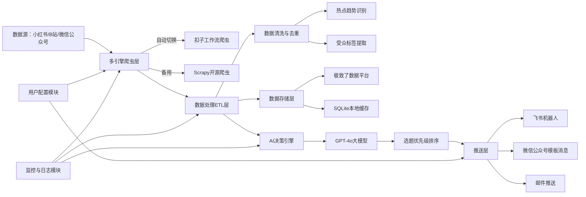

# 技术落地架构指南：AI驱动全自动化选题决策系统

## 架构图 (Mermaid)

## 框架映射（形态-数据-服务-分发-触达）
1. **形态**：以“每日选题清单推送”为核心交付形态，配套轻量后台管理界面用于配置与监控
2. **数据**：覆盖多平台热点数据、用户评论数据、竞品公开数据，通过ETL层结构化后存储，核心用于AI决策而非量化展示
3. **服务**：实现三大核心服务：
   - 智能爬虫服务：自动切换工具绕过限制
   - 数据洞察服务：识别热点、提取受众标签
   - AI决策服务：生成定性选题建议并排序
4. **分发**：采用定时触发机制，每日按用户预设时间批量生成并推送清单
5. **触达**：适配用户常用的即时通讯渠道（飞书/微信），确保信息第一时间触达

## 技术栈选型
### 前端/交互层
- 轻量管理后台：Streamlit（快速搭建Python-based可视化界面，适配AI专家用户的技术习惯）
- 推送渠道：飞书机器人API、微信公众号模板消息API（用户熟悉的办公/内容生态工具）

### 逻辑/编排层
- 工作流编排：扣子工作流（用户已掌握，内置爬虫插件，支持可视化配置自动切换规则）
- 数据处理：Python脚本（Pandas用于数据清洗，NLTK用于文本分析）
- 异常处理：自定义Python调度器，实现爬虫失败时的自动切换与跳过逻辑

### 数据/存储层
- 核心存储：极致了数据平台（用户已知工具，支持多源数据整合与可视化监控）
- 本地缓存：SQLite（用于临时存储爬取数据，避免重复请求）

### 模型层
- 决策生成：GPT-4o（具备强大的文本理解与逻辑推理能力，适合生成定性选题建议）
- 辅助分析：通义千问（用于批量处理评论情感分析、受众标签提取等基础NLP任务）

## 关键难点攻克
1. **平台爬虫限制规避**
   - 解决方案：配置多爬虫引擎的权重切换规则（如扣子工作流爬虫失败3次后自动切换至Scrapy）；设置请求频率限制（如每10秒请求1次）；使用代理池IP轮换；遵守目标平台robots协议
   - 落地步骤：在扣子工作流中配置“爬虫失败触发备用工具”的分支逻辑，通过Python脚本动态加载代理IP

2. **AI选题建议准确性不足**
   - 解决方案：采用Few-Shot Prompt Engineering，注入同领域Top账号的选题成功案例作为参考；定期用用户的历史选题数据微调模型prompt；建立选题效果反馈闭环（将涨粉数据回传给模型优化决策逻辑）
   - 落地步骤：在GPT-4o的prompt中加入“参考小红书美妆类Top10账号近30天涨粉Top5选题的结构”等约束条件

3. **数据缺失导致报告不完整**
   - 解决方案：在ETL层设置数据完整性校验规则，对缺失的单平台/单维度数据标记为“未获取”，并在AI决策时自动忽略该维度；生成报告时明确标注缺失数据范围，避免误导用户
   - 落地步骤：在Python数据处理脚本中加入`try-except`块，捕获爬取异常后记录日志并跳过该数据项

## 版本与发布策略
### 版本管理策略
- 采用GitFlow工作流，适配AI专家用户的开发习惯：
  - `main`分支：稳定发布版本，仅用于正式上线
  - `develop`分支：日常开发分支，整合所有功能迭代
  - `feature/*`分支：单个P1功能的开发分支（如`feature/competitor-analysis`）
  - `hotfix/*`分支：线上bug紧急修复分支

### 发布节奏
1. **MVP阶段（v1.0）**：2周内完成P0功能开发与测试，实现核心闭环（爬虫→热点识别→选题生成→推送）
2. **迭代阶段（v1.1-v1.3）**：每2周发布一个版本，依次上线P1功能（竞品分析→情感分析→变现潜力评估）
3. **优化阶段（v2.0+）**：每月发布一次版本，基于用户反馈与涨粉数据优化AI决策模型、爬虫策略

### 发布渠道
- 核心功能（爬虫+决策+推送）部署在扣子工作流平台，利用其可视化编排能力降低维护成本
- 后台管理界面部署在个人云服务器（如阿里云ECS），通过Streamlit Sharing快速发布